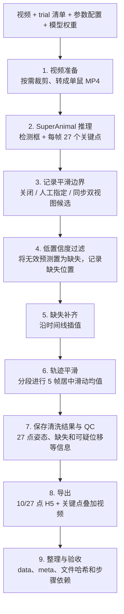

# SuperAnimal Pipeline

**顶视单鼠视频的批量姿态估计与后处理工具。**

给它视频、模型权重和一份 trial 清单，它会调用 SuperAnimal 预测关键点，过滤低置信度结果，补齐缺失位置，平滑轨迹，最后导出 10/27 点 H5、关键点叠加视频和质量报告。

适用于每个分析画面只有一只小鼠的顶视视频。双箱视频可以在清单中指定左右裁剪区域，分别作为两个 trial 处理。工具独立运行，不依赖 AutoCBE；MoSeq、动作命名和组间统计由下游程序完成。

## 视频怎样变成姿态数据

下面是使用已有 checkpoint 时的处理流程。



程序先完成所有 trial 的视频准备和推理，再计算平滑边界，随后逐条清洗、导出。第 3 步只给第 6 步提供边界，不删除帧或修补原视频。关闭边界检测时，轨迹按整段视频平滑。

普通 `sap run` 使用 `video_adapt=False`，不会自动训练模型。已有原始预测时，也可以跳过模型推理，直接处理同源 JSON/H5。

## 跑完会得到什么

每个 trial 都有一份姿态表、一段分析视频和质量报告。开启视频导出后，还会把关键点与骨架画在视频上，方便人工检查。

```text
outputs/my-run/
├── data/05/                   # 指向已验收导出目录的相对软链接
│   ├── 01_original.mp4        # 分析用单鼠视频，可能已裁剪或转码
│   ├── 02_cleaned.h5          # 选择的 10 或 27 点
│   ├── 02_cleaned_27kp.h5     # 选择 10 点时保留完整 27 点副本
│   ├── 03_labeled_cleaned.mp4 # 开启 labeled_video 后生成
│   └── qc.json
├── meta.csv                  # trial、animal、group 和数据相对路径
├── provenance.json           # 输入、权重、参数、代码和依赖版本
├── receipts/                 # 各步骤的文件哈希和依赖记录
├── work/                     # 原始预测、清洗结果、缺失记录与运行尝试
├── status.json
└── verification.json
```

“标注视频”显示的是关键点和骨架，不包含动作类别。H5 中的坐标单位为**像素**，毫米标定留给下游处理。10 点数据直接从清洗后的 27 点表选列，不再滤波。

## 开始使用

### 安装

GPU 推理按 Linux、Python 3.11 和 NVIDIA GPU 环境准备。以下依赖版本来自本项目已有验证记录；换机器后，先用短视频检查安装和推理是否正常。

代码可直接从 GitHub 克隆。视频和权重由使用者另行提供。

```bash
git clone https://github.com/Wall-breakerL/superanimal-pipeline.git
cd superanimal-pipeline
python3.11 -m venv .venv
source .venv/bin/activate
python -m pip install --upgrade pip
python -m pip install torch==2.8.0 torchvision==0.23.0 --index-url https://download.pytorch.org/whl/cu128
python -m pip install -e '.[inference]'
python -m pip check
sap doctor
```

仅清洗和导出已有预测时，在 Python 3.11 环境执行 `python -m pip install -e .` 即可，不要求安装 DLC 或使用 GPU。

### 填写配置和视频清单

从这两个示例开始。

| 文件 | 需要填写的内容 |
|---|---|
| [examples/config.yaml](examples/config.yaml) | 模型模式、权重路径、清洗参数、输出目录、点数和视频开关 |
| [examples/trials.csv](examples/trials.csv) | 视频路径、trial/animal/group 编号，以及可选的裁剪区域与同步关系 |

把示例中的视频和权重路径换成自己的文件，选择一个新的输出目录。trial ID 按字符串保留，`05` 会保留前导零。

`model.mode` 有三种选择。

| 模式 | 什么时候用 | 需要准备什么 |
|---|---|---|
| `checkpoint` | 使用已有适配权重推理 | pose 和 detector 两个 checkpoint |
| `zero-shot` | 使用上游预训练模型 | 不填自定义权重，首次运行可能下载模型 |
| `precomputed` | 清洗已有原始预测 | 清单中填写同源视频、`raw_json` 和 `raw_h5` |

### 检查、运行、验收

```bash
sap check --config examples/config.yaml
sap run --config examples/config.yaml
sap verify --config examples/config.yaml
```

`check` 检查配置、文件、权重和输入哈希，不执行模型。`run` 输出当前 trial、视频、处理步骤和叠加视频帧进度。完成后，用 `verify` 核对结果文件、依赖关系与发布目录。

看到 `COMPLETE` 且验收通过，再查看关键点叠加视频和 QC。文件齐全只能证明程序完成了规定处理，姿态质量仍需人工判断。

## 在服务器后台运行

先激活环境并进入仓库目录，再创建 tmux 会话。

```bash
tmux new -s superanimal
set -o pipefail
sap run --config examples/config.yaml 2>&1 | tee run.log
```

先按 Ctrl+B，松开后按 D，可以离开会话而保持任务运行。重新连接服务器后，用 `tmux attach -t superanimal` 回到任务。

在另一个终端查看进度。

```bash
sap status --config examples/config.yaml
tail -f run.log
```

`status` 显示最后一次记录，任务是否仍在运行还要结合 tmux 和日志判断。查看日志时按 Ctrl+C 只会退出 `tail`。

如果任务失败或中断，在确认旧进程已结束后，用同一条 `sap run` 命令重试。程序会校验已完成步骤的文件哈希和依赖，验证通过才复用；未完成的步骤会另建目录重算，旧尝试保留供排查。

输入、参数、代码、依赖版本或权重变化后，需要新的输出目录。一个 trial 失败会停止本次批处理，之前完成的步骤仍有记录。

## 清洗规则要先看清

默认平滑采用 **5 帧居中滑动均值**。下面这些规则沿用历史处理方法，使用前需要确认它们适合自己的数据。

| 处理 | 当前规则 | 使用时要留意的地方 |
|---|---|---|
| 低置信度过滤 | 框置信度低于 0.5、点置信度低于 0.1 时分别置空 | 框和点各自判断，阈值可配置 |
| 缺失补齐 | 沿时间线线性插值，双向补齐 | 没有 gap 长度上限，likelihood 也会插值 |
| 轨迹平滑 | 只处理 x/y，居中 rolling mean，默认窗口 5、min_periods=1 | 使用均值滤波；长缺失段补出的轨迹也会参与平滑 |
| 平滑边界 | `off`、人工指定或同步双视图候选检测 | 只限制平滑范围，当前插值仍不分段 |
| 无法补齐 | 整列没有有效值时失败 | 保留缺失报告，供人工检查 |
| 质量检查 | 记录较大位移和超出图像范围的点 | 不自动删点，也不检查实验场地 ROI |

`long_gap_threshold` 只决定哪些缺口被记作长缺失段，不限制插值长度。模型推理配置中的 `bbox_threshold` 与清洗阈值分开设置，示例分别为 0.9 和 0.5。

同步候选检测仅适用于同一时间线拍摄的两个视图。默认使用各自 bbox 位移的 99.9% 分位数寻找共同跳变，候选需要人工判断；清单里的 `pair_id` 表示同步拍摄关系，不代表生物学配对。方法细节见 [清洗方法与限制](docs/methods.md)。

## 需要重新适配模型时

适配训练有单独的入口。先准备已裁剪的单鼠 MP4，再选择一个尚不存在的输出目录。

```bash
sap adapt --video /path/to/already-cropped-single-mouse.mp4 --output /path/to/new-adaptation-run
```

该入口沿用 detector 4 + pose 4 epochs 的设置。成功后，`adaptation.json` 会记录两个 checkpoint 的路径，将它们填入批处理配置即可用于推理。失败的适配需要另建目录重新开始，目前不支持恢复训练。

## 把结果交给下游

下游程序可以读取 `meta.csv`、`data/<trial>/02_cleaned.h5` 和 `01_original.mp4`。迁移或归档时，保留整个输出根目录，软链接、原始预测和处理记录才能一起带走。

如果只需要一份可独立读取的数据副本，选择一个新的目标目录，解引用软链接后复制，再带上 metadata。

```bash
mkdir -p destination/data
rsync -aL outputs/my-run/data/ destination/data/
cp outputs/my-run/meta.csv destination/meta.csv
```

这份副本适合下游读取，不包含 `work/` 中的原始预测和完整处理记录。原视频与原始 H5 始终保留，处理时不补造帧或主动重采样帧率；转码可能带来轻微帧率舍入。

## 已经验证到哪里

2026-09-10 的验收记录包括以下结果。

- macOS 与 Linux 各 19 项测试通过，覆盖配置、清洗、导出、帧数、步骤复用和篡改拒绝等情况。
- 两条历史结果合计 34,938 帧，清洗后的 H5 数值、结构和 JSON 内容精确回归通过。
- RTX 4090 上，200 帧真实视频的新推理、清洗、10 点导出、叠加视频和缓存续跑通过，端到端处理约 17.5 秒。

这组证据来自测试和短片运行，没有人工标注真值，不能据此判断全批数据的定位精度或适配训练效果。zero-shot 下载和陌生机器从零安装也仍需验证。完整范围见 [验收记录](docs/verification.md)与 [GPU 实测](docs/gpu-validation-20260910.md)。

本地测试无需下载模型。

```bash
python -m unittest discover -s tests -v
```

## 从哪里读代码

先看命令入口，再沿调度器进入具体处理函数。

| 文件 | 主要内容 |
|---|---|
| [cli.py](src/superanimal_pipeline/cli.py) | `check/run/verify/status/doctor/adapt` 命令 |
| [config.py](src/superanimal_pipeline/config.py) | 配置、视频清单、路径与参数校验 |
| [runner.py](src/superanimal_pipeline/runner.py) | 步骤顺序、进度、结果复用和数据发布 |
| [processing.py](src/superanimal_pipeline/processing.py) | 视频准备、模型调用、清洗、导出和视频叠加 |
| [legacy.py](src/superanimal_pipeline/legacy.py) | 原样保留的历史清洗脚本 |

## 模型来源与引用

模型由 DeepLabCut 提供调用接口，本仓库封装批处理和后处理，不复制上游模型实现。可参考 [SuperAnimal 文档](https://deeplabcut.github.io/DeepLabCut/examples/COLAB/COLAB_YOURDATA_SuperAnimal.html)和 [DeepLabCut 安装说明](https://deeplabcut.github.io/DeepLabCut/docs/installation.html)。本项目的依赖以已有验证版本为准。

本项目是独立维护的批处理工具，与 DeepLabCut / SuperAnimal 官方项目无隶属关系。模型方法与预训练模型来自上游作者，本仓库提供流程组织、姿态后处理和数据导出。

使用 SuperAnimal 模型开展研究时，请按[官方引用说明](https://deeplabcut.github.io/DeepLabCut/docs/citation.html)引用原工作。

- Ye, S., Filippova, A., Lauer, J., et al. *SuperAnimal pretrained pose estimation models for behavioral analysis*. Nature Communications **15**, 5165 (2024). [论文与 DOI](https://doi.org/10.1038/s41467-024-48792-2)。
- DeepLabCut 软件的引用同时参考 [Mathis et al., 2018](https://doi.org/10.1038/s41593-018-0209-y) 和 [Nath et al., 2019](https://doi.org/10.1038/s41596-019-0176-0)。实际使用其他上游功能时，再按官方说明补充相应文献。

```bibtex
@article{Ye2024SuperAnimal,
  title = {SuperAnimal pretrained pose estimation models for behavioral analysis},
  author = {Ye, Shaokai and Filippova, Anastasiia and Lauer, Jessy and Schneider, Steffen and Vidal, Maxime and Qiu, Tian and Mathis, Alexander and Mathis, Mackenzie Weygandt},
  journal = {Nature Communications},
  volume = {15},
  pages = {5165},
  year = {2024},
  doi = {10.1038/s41467-024-48792-2}
}
```

## 授权与使用范围

[DeepLabCut 官方许可说明](https://github.com/DeepLabCut/DeepLabCut#license)将其软件主要许可证列为 LGPL v3，并单独说明 SuperAnimal 模型仅供非商业研究使用。软件、模型和实验数据的许可需要分别确认，引用论文不能代替遵守许可。本仓库不分发模型权重。

代码托管于公开仓库 [Wall-breakerL/superanimal-pipeline](https://github.com/Wall-breakerL/superanimal-pipeline)。项目自身尚未选择开源许可证，不应据此推定拥有任意再许可或商业使用权限。历史脚本来源、作者归属和授权待办保留在 [provenance.md](docs/provenance.md)。真实视频、模型权重与凭据不进入 Git。后续工作见 [handoff.md](docs/handoff.md)。
